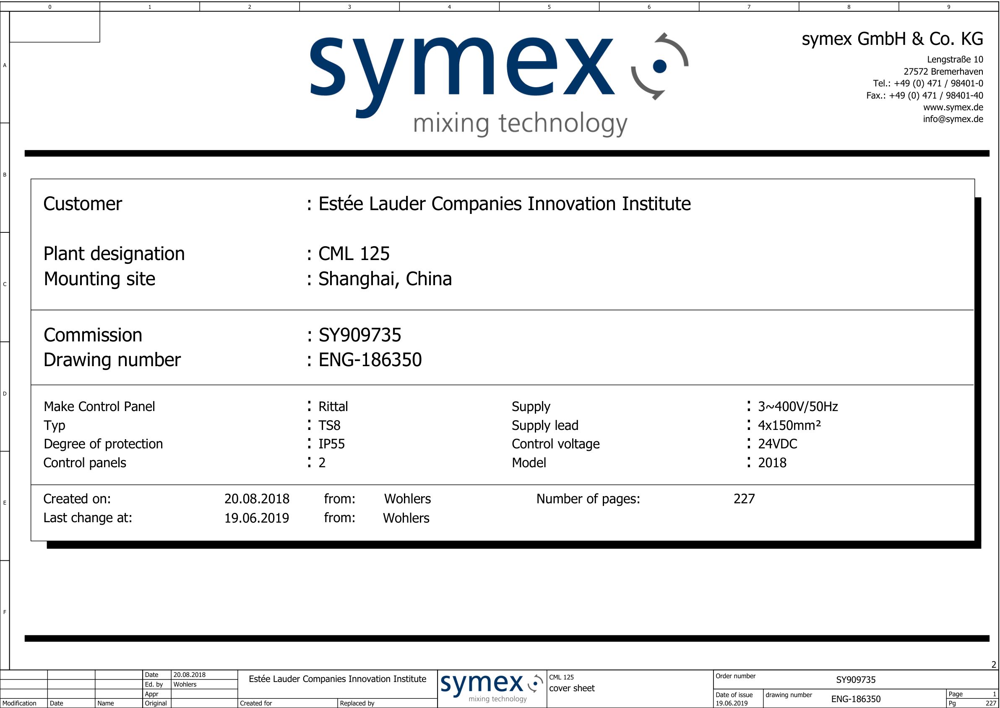
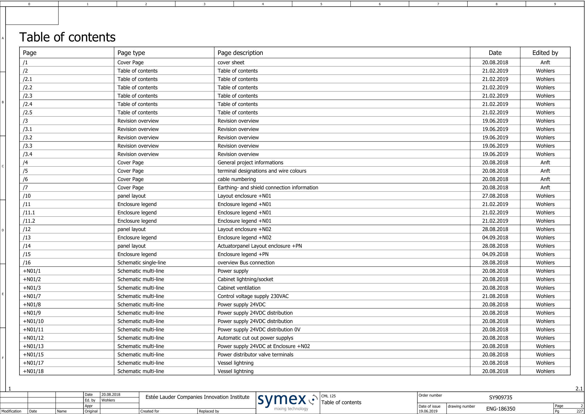
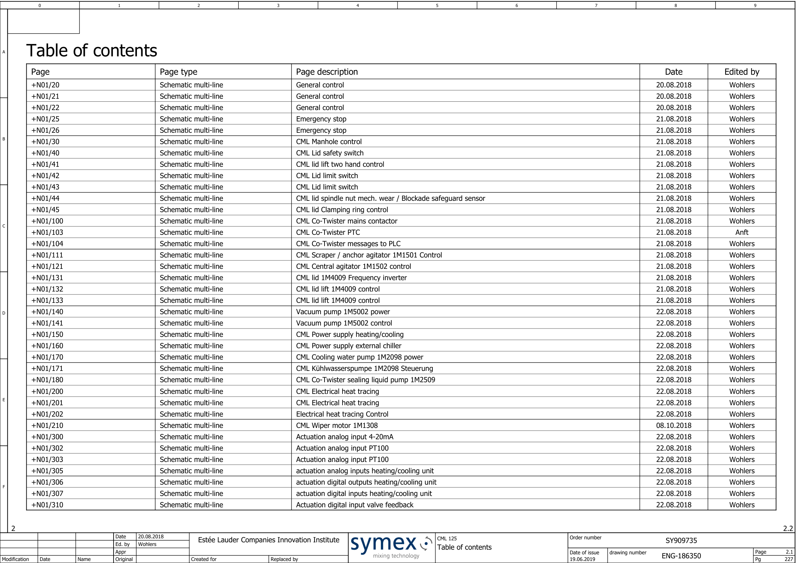

# SY909735_Wiring diagram_Revision B_19_06_2019

## Document Summary

_No summary generated._

## Document Classification

- document_kind: technical_drawing_pdf
- quality_status: low_structure
- extraction_status: text
- requires_ocr_or_vision: false

## Key Metadata

- source_file: SY909735_Wiring diagram_Revision B_19_06_2019.pdf
- converter: markitdown
- tags: wiring-diagram, pdf, low-structure, technical-drawing

## Source Traceability

- source_path: C:\Users\hcai\Downloads\SY909735_Wiring diagram_Revision B_19_06_2019.pdf
- checksum: sha256:cd33806e072f2f5ff10447d18109bb8040b2b9fa6c726a7926481d668fa091a7

## Page Index

## Drawing Index

| Page Code | Description | Type | Date | Edited By | Source |
|---|---|---|---|---|---|
| /2 | Table of contents | Table of contents | 21.02.2019 | Wohlers | Table of Contents / Page 2 |
| /2.1 | Table of contents | Table of contents | 21.02.2019 | Wohlers | Table of Contents / Page 2 |
| /2.2 | Table of contents | Table of contents | 21.02.2019 | Wohlers | Table of Contents / Page 2 |
| /2.3 | Table of contents | Table of contents | 21.02.2019 | Wohlers | Table of Contents / Page 2 |
| /2.4 | Table of contents | Table of contents | 21.02.2019 | Wohlers | Table of Contents / Page 2 |
| /2.5 | Table of contents | Table of contents | 21.02.2019 | Wohlers | Table of Contents / Page 2 |
| /5 | terminal designations and wire colours | Cover Page | 20.08.2018 | Anft | Table of Contents / Page 2 |
| /6 | cable numbering | Cover Page | 20.08.2018 | Anft | Table of Contents / Page 2 |
| /7 | Earthing- and shield connection information | Cover Page | 20.08.2018 | Anft | Table of Contents / Page 2 |
| /10 | Layout enclosure +N01 | panel layout | 27.08.2018 | Wohlers | Table of Contents / Page 2 |
| /11 | Enclosure legend +N01 | Enclosure legend | 21.02.2019 | Wohlers | Table of Contents / Page 2 |
| /11.1 | Enclosure legend +N01 | Enclosure legend | 21.02.2019 | Wohlers | Table of Contents / Page 2 |
| /11.2 | Enclosure legend +N01 | Enclosure legend | 21.02.2019 | Wohlers | Table of Contents / Page 2 |
| /12 | Layout enclosure +N02 | panel layout | 28.08.2018 | Wohlers | Table of Contents / Page 2 |
| /13 | Enclosure legend +N02 | Enclosure legend | 04.09.2018 | Wohlers | Table of Contents / Page 2 |
| /14 | Actuatorpanel Layout enclosure +PN | panel layout | 28.08.2018 | Wohlers | Table of Contents / Page 2 |
| /15 | Enclosure legend +PN | Enclosure legend | 04.09.2018 | Wohlers | Table of Contents / Page 2 |
| /16 | overview Bus connection | Schematic single-line | 28.08.2018 | Wohlers | Table of Contents / Page 2 |
| +N01/1 | Power supply | Schematic multi-line | 20.08.2018 | Wohlers | Table of Contents / Page 2 |
| +N01/2 | Cabinet lightning/socket | Schematic multi-line | 20.08.2018 | Wohlers | Table of Contents / Page 2 |
| +N01/3 | Cabinet ventilation | Schematic multi-line | 20.08.2018 | Wohlers | Table of Contents / Page 2 |
| +N01/7 | Control voltage supply 230VAC | Schematic multi-line | 21.08.2018 | Wohlers | Table of Contents / Page 2 |
| +N01/8 | Power supply 24VDC | Schematic multi-line | 20.08.2018 | Wohlers | Table of Contents / Page 2 |
| +N01/9 | Power supply 24VDC distribution | Schematic multi-line | 20.08.2018 | Wohlers | Table of Contents / Page 2 |
| +N01/10 | Power supply 24VDC distribution | Schematic multi-line | 20.08.2018 | Wohlers | Table of Contents / Page 2 |
| +N01/11 | Power supply 24VDC distribution 0V | Schematic multi-line | 20.08.2018 | Wohlers | Table of Contents / Page 2 |
| +N01/12 | Automatic cut out power supplys | Schematic multi-line | 20.08.2018 | Wohlers | Table of Contents / Page 2 |
| +N01/13 | Power supply 24VDC at Enclosure +N02 | Schematic multi-line | 20.08.2018 | Wohlers | Table of Contents / Page 2 |
| +N01/15 | Power distributor valve terminals | Schematic multi-line | 20.08.2018 | Wohlers | Table of Contents / Page 2 |
| +N01/17 | Vessel lightning | Schematic multi-line | 20.08.2018 | Wohlers | Table of Contents / Page 2 |
| +N01/18 | Vessel lightning | Schematic multi-line | 20.08.2018 | Wohlers | Table of Contents / Page 2 |
| +N01/20 | General control | Schematic multi-line | 20.08.2018 | Wohlers | Table of Contents / Page 3 |
| +N01/21 | General control | Schematic multi-line | 20.08.2018 | Wohlers | Table of Contents / Page 3 |
| +N01/22 | General control | Schematic multi-line | 20.08.2018 | Wohlers | Table of Contents / Page 3 |
| +N01/25 | Emergency stop | Schematic multi-line | 21.08.2018 | Wohlers | Table of Contents / Page 3 |
| +N01/26 | Emergency stop | Schematic multi-line | 21.08.2018 | Wohlers | Table of Contents / Page 3 |
| +N01/30 | CML Manhole control | Schematic multi-line | 21.08.2018 | Wohlers | Table of Contents / Page 3 |
| +N01/40 | CML Lid safety switch | Schematic multi-line | 21.08.2018 | Wohlers | Table of Contents / Page 3 |
| +N01/41 | CML lid lift two hand control | Schematic multi-line | 21.08.2018 | Wohlers | Table of Contents / Page 3 |
| +N01/42 | CML Lid limit switch | Schematic multi-line | 21.08.2018 | Wohlers | Table of Contents / Page 3 |
| +N01/43 | CML Lid limit switch | Schematic multi-line | 21.08.2018 | Wohlers | Table of Contents / Page 3 |
| +N01/44 | CML lid spindle nut mech. wear / Blockade safeguard sensor | Schematic multi-line | 21.08.2018 | Wohlers | Table of Contents / Page 3 |
| +N01/45 | CML lid Clamping ring control | Schematic multi-line | 21.08.2018 | Wohlers | Table of Contents / Page 3 |
| +N01/100 | CML Co-Twister mains contactor | Schematic multi-line | 21.08.2018 | Wohlers | Table of Contents / Page 3 |
| +N01/103 | CML Co-Twister PTC | Schematic multi-line | 21.08.2018 | Anft | Table of Contents / Page 3 |
| +N01/104 | CML Co-Twister messages to PLC | Schematic multi-line | 21.08.2018 | Wohlers | Table of Contents / Page 3 |
| +N01/111 | CML Scraper / anchor agitator 1M1501 Control | Schematic multi-line | 21.08.2018 | Wohlers | Table of Contents / Page 3 |
| +N01/121 | CML Central agitator 1M1502 control | Schematic multi-line | 21.08.2018 | Wohlers | Table of Contents / Page 3 |
| +N01/131 | CML lid 1M4009 Frequency inverter | Schematic multi-line | 21.08.2018 | Wohlers | Table of Contents / Page 3 |
| +N01/132 | CML lid lift 1M4009 control | Schematic multi-line | 21.08.2018 | Wohlers | Table of Contents / Page 3 |
| +N01/133 | CML lid lift 1M4009 control | Schematic multi-line | 21.08.2018 | Wohlers | Table of Contents / Page 3 |
| +N01/140 | Vacuum pump 1M5002 power | Schematic multi-line | 22.08.2018 | Wohlers | Table of Contents / Page 3 |
| +N01/141 | Vacuum pump 1M5002 control | Schematic multi-line | 22.08.2018 | Wohlers | Table of Contents / Page 3 |
| +N01/150 | CML Power supply heating/cooling | Schematic multi-line | 22.08.2018 | Wohlers | Table of Contents / Page 3 |
| +N01/160 | CML Power supply external chiller | Schematic multi-line | 22.08.2018 | Wohlers | Table of Contents / Page 3 |
| +N01/170 | CML Cooling water pump 1M2098 power | Schematic multi-line | 22.08.2018 | Wohlers | Table of Contents / Page 3 |
| +N01/171 | CML Kühlwasserspumpe 1M2098 Steuerung | Schematic multi-line | 22.08.2018 | Wohlers | Table of Contents / Page 3 |
| +N01/180 | CML Co-Twister sealing liquid pump 1M2509 | Schematic multi-line | 22.08.2018 | Wohlers | Table of Contents / Page 3 |
| +N01/200 | CML Electrical heat tracing | Schematic multi-line | 22.08.2018 | Wohlers | Table of Contents / Page 3 |
| +N01/201 | CML Electrical heat tracing | Schematic multi-line | 22.08.2018 | Wohlers | Table of Contents / Page 3 |
| +N01/202 | Electrical heat tracing Control | Schematic multi-line | 22.08.2018 | Wohlers | Table of Contents / Page 3 |
| +N01/210 | CML Wiper motor 1M1308 | Schematic multi-line | 08.10.2018 | Wohlers | Table of Contents / Page 3 |
| +N01/300 | Actuation analog input 4-20mA | Schematic multi-line | 22.08.2018 | Wohlers | Table of Contents / Page 3 |
| +N01/302 | Actuation analog input PT100 | Schematic multi-line | 22.08.2018 | Wohlers | Table of Contents / Page 3 |
| +N01/303 | Actuation analog input PT100 | Schematic multi-line | 22.08.2018 | Wohlers | Table of Contents / Page 3 |
| +N01/305 | actuation analog inputs heating/cooling unit | Schematic multi-line | 22.08.2018 | Wohlers | Table of Contents / Page 3 |
| +N01/306 | actuation digital outputs heating/cooling unit | Schematic multi-line | 22.08.2018 | Wohlers | Table of Contents / Page 3 |
| +N01/307 | actuation digital inputs heating/cooling unit | Schematic multi-line | 22.08.2018 | Wohlers | Table of Contents / Page 3 |
| +N01/310 | Actuation digital input valve feedback | Schematic multi-line | 22.08.2018 | Wohlers | Table of Contents / Page 3 |

- Cover Sheet: Page 1 - assets/page_001.png
- Table of Contents: Page 2 - assets/page_002.png
- Table of Contents: Page 3 - assets/page_003.png

## Cover Sheet

Source page: 1

### Extracted Text

Page
Pg
CML 125
Ed. by
Original
ENG-186350
SY909735
Date
Date
Replaced by
cover sheet
1
Modification
0
7
6
Appr
Created for
8
9
3
227
2
4
1
2
Name
5
Date of issue
Estée Lauder Companies Innovation Institute
19.06.2019
20.08.2018
F
E
D
C
B
A
drawing number
Order number
Wohlers
Customer
Plant designation
Drawing number
Control panels 
Created on:
Last change at:
Mounting site 
Commission
Make Control Panel
Typ
Degree of protection  
20.08.2018
:
:
:
:
:
:
:
:
:
Estée Lauder Companies Innovation Institute
CML 125
Shanghai, China
ENG-186350
Rittal
TS8
IP55
2
SY909735
from:
from:
Wohlers
Supply 
Supply lead 
Control voltage 
Model 
Number of pages:
227
:
:
:
:
3~400V/50Hz
4x150mm²
24VDC
2018
symex GmbH & Co. KG
Lengstraße 10
27572 Bremerhaven
Tel.: +49 (0) 471 / 98401-0
Fax.: +49 (0) 471 / 98401-40
www.symex.de
info@symex.de
Wohlers
19.06.2019

### Notes

## Table of Contents

Source page: 2

### Extracted Text

Page
Pg
CML 125
Ed. by
1
Original
ENG-186350
SY909735
Date
Date
Replaced by
Table of contents
1
Modification
0
7
6
Appr
Created for
8
9
3
227
2.1
4
2
2
Name
5
Date of issue
Estée Lauder Companies Innovation Institute
19.06.2019
20.08.2018
F
E
D
C
B
A
drawing number
Order number
Wohlers
Edited by
Page type
Table of contents
Date
Page description
Page
/1
cover sheet
Cover Page
20.08.2018
/2
Wohlers
Table of contents
Table of contents
21.02.2019
/2.1
Wohlers
Table of contents
Table of contents
21.02.2019
/2.2
Wohlers
Table of contents
Table of contents
21.02.2019
/2.3
Wohlers
Table of contents
Table of contents
21.02.2019
/2.4
Wohlers
Table of contents
Table of contents
21.02.2019
/2.5
Wohlers
Table of contents
Table of contents
21.02.2019
/3
Revision overview
Revision overview
19.06.2019
/3.1
Revision overview
Revision overview
19.06.2019
/3.2
Revision overview
Revision overview
19.06.2019
/3.3
Revision overview
Revision overview
19.06.2019
/3.4
Revision overview
Revision overview
19.06.2019
/4
General project informations
Cover Page
20.08.2018
/5
Anft
terminal designations and wire colours
Cover Page
20.08.2018
/6
Anft
cable numbering
Cover Page
20.08.2018
/7
Anft
Earthing- and shield connection information
Cover Page
20.08.2018
/10
Wohlers
Layout enclosure +N01
panel layout
27.08.2018
/11
Wohlers
Enclosure legend +N01
Enclosure legend
21.02.2019
/11.1
Wohlers
Enclosure legend +N01
Enclosure legend
21.02.2019
/11.2
Wohlers
Enclosure legend +N01
Enclosure legend
21.02.2019
/12
Wohlers
Layout enclosure +N02
panel layout
28.08.2018
/13
Wohlers
Enclosure legend +N02
Enclosure legend
04.09.2018
/14
Wohlers
Actuatorpanel Layout enclosure +PN
panel layout
28.08.2018
/15
Wohlers
Enclosure legend +PN
Enclosure legend
04.09.2018
/16
Wohlers
overview Bus connection
Schematic single-line
28.08.2018
+N01/1
Wohlers
Power supply
Schematic multi-line
20.08.2018
+N01/2
Wohlers
Cabinet lightning/socket
Schematic multi-line
20.08.2018
+N01/3
Wohlers
Cabinet ventilation
Schematic multi-line
20.08.2018
+N01/7
Wohlers
Control voltage supply 230VAC
Schematic multi-line
21.08.2018
+N01/8
Wohlers
Power supply 24VDC
Schematic multi-line
20.08.2018
+N01/9
Wohlers
Power supply 24VDC distribution
Schematic multi-line
20.08.2018
+N01/10
Wohlers
Power supply 24VDC distribution
Schematic multi-line
20.08.2018
+N01/11
Wohlers
Power supply 24VDC distribution 0V
Schematic multi-line
20.08.2018
+N01/12
Wohlers
Automatic cut out power supplys
Schematic multi-line
20.08.2018
+N01/13
Wohlers
Power supply 24VDC at Enclosure +N02
Schematic multi-line
20.08.2018
+N01/15
Wohlers
Power distributor valve terminals
Schematic multi-line
20.08.2018
+N01/17
Wohlers
Vessel lightning
Schematic multi-line
20.08.2018
+N01/18
Wohlers
Vessel lightning
Schematic multi-line
20.08.2018
Wohlers
Wohlers
Anft
Wohlers
Wohlers
Wohlers
Anft

### Notes

## Table of Contents

Source page: 3

### Extracted Text

Page
Pg
CML 125
Ed. by
2
Original
ENG-186350
SY909735
Date
Date
Replaced by
Table of contents
1
Modification
0
7
6
Appr
Created for
8
9
3
227
2.2
4
2.1
2
Name
5
Date of issue
Estée Lauder Companies Innovation Institute
19.06.2019
20.08.2018
F
E
D
C
B
A
drawing number
Order number
Wohlers
Edited by
Page type
Table of contents
Date
Page description
Page
+N01/20
Wohlers
General control
Schematic multi-line
20.08.2018
+N01/21
Wohlers
General control
Schematic multi-line
20.08.2018
+N01/22
Wohlers
General control
Schematic multi-line
20.08.2018
+N01/25
Wohlers
Emergency stop
Schematic multi-line
21.08.2018
+N01/26
Wohlers
Emergency stop
Schematic multi-line
21.08.2018
+N01/30
Wohlers
CML Manhole control
Schematic multi-line
21.08.2018
+N01/40
Wohlers
CML Lid safety switch
Schematic multi-line
21.08.2018
+N01/41
Wohlers
CML lid lift two hand control
Schematic multi-line
21.08.2018
+N01/42
Wohlers
CML Lid limit switch
Schematic multi-line
21.08.2018
+N01/43
Wohlers
CML Lid limit switch
Schematic multi-line
21.08.2018
+N01/44
Wohlers
CML lid spindle nut mech. wear / Blockade safeguard sensor
Schematic multi-line
21.08.2018
+N01/45
Wohlers
CML lid Clamping ring control
Schematic multi-line
21.08.2018
+N01/100
Wohlers
CML Co-Twister mains contactor
Schematic multi-line
21.08.2018
+N01/103
Anft
CML Co-Twister PTC
Schematic multi-line
21.08.2018
+N01/104
Wohlers
CML Co-Twister messages to PLC
Schematic multi-line
21.08.2018
+N01/111
Wohlers
CML Scraper / anchor agitator 1M1501 Control
Schematic multi-line
21.08.2018
+N01/121
Wohlers
CML Central agitator 1M1502 control
Schematic multi-line
21.08.2018
+N01/131
Wohlers
CML lid 1M4009 Frequency inverter
Schematic multi-line
21.08.2018
+N01/132
Wohlers
CML lid lift 1M4009 control
Schematic multi-line
21.08.2018
+N01/133
Wohlers
CML lid lift 1M4009 control
Schematic multi-line
21.08.2018
+N01/140
Wohlers
Vacuum pump 1M5002 power
Schematic multi-line
22.08.2018
+N01/141
Wohlers
Vacuum pump 1M5002 control
Schematic multi-line
22.08.2018
+N01/150
Wohlers
CML Power supply heating/cooling
Schematic multi-line
22.08.2018
+N01/160
Wohlers
CML Power supply external chiller
Schematic multi-line
22.08.2018
+N01/170
Wohlers
CML Cooling water pump 1M2098 power
Schematic multi-line
22.08.2018
+N01/171
Wohlers
CML Kühlwasserspumpe 1M2098 Steuerung
Schematic multi-line
22.08.2018
+N01/180
Wohlers
CML Co-Twister sealing liquid pump 1M2509
Schematic multi-line
22.08.2018
+N01/200
Wohlers
CML Electrical heat tracing
Schematic multi-line
22.08.2018
+N01/201
Wohlers
CML Electrical heat tracing
Schematic multi-line
22.08.2018
+N01/202
Wohlers
Electrical heat tracing Control
Schematic multi-line
22.08.2018
+N01/210
Wohlers
CML Wiper motor 1M1308
Schematic multi-line
08.10.2018
+N01/300
Wohlers
Actuation analog input 4-20mA
Schematic multi-line
22.08.2018
+N01/302
Wohlers
Actuation analog input PT100
Schematic multi-line
22.08.2018
+N01/303
Wohlers
Actuation analog input PT100
Schematic multi-line
22.08.2018
+N01/305
Wohlers
actuation analog inputs heating/cooling unit
Schematic multi-line
22.08.2018
+N01/306
Wohlers
actuation digital outputs heating/cooling unit
Schematic multi-line
22.08.2018
+N01/307
Wohlers
actuation digital inputs heating/cooling unit
Schematic multi-line
22.08.2018
+N01/310
Wohlers
Actuation digital input valve feedback
Schematic multi-line
22.08.2018

### Notes
